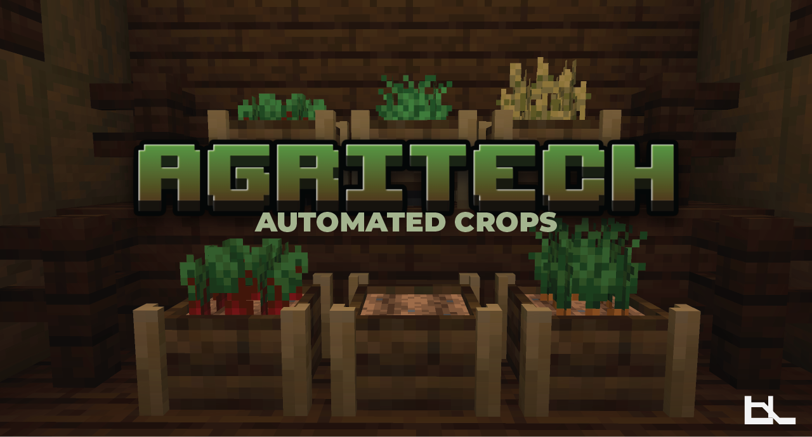

AgriTech introduces customizable planters that streamline crop growing and autmomated harvesting.

Inspired by **Botany Pots by DarkhaxDev**

## Features

- **Automated Crop Growth**: Plant seeds and watch them grow automatically
- **Hopping Planters**: Automatically output harvested items to containers below
- **Internal Storage**: Built-in inventory to store harvested crops
- **Wide Crop Compatibility**: Works with vanilla crops and many modded crops
- **Configurable Soil Types**: Different soils affect growth speed

## Supported Crops

AgriTech supports all vanilla crops including:
- Wheat, Beetroot, Carrot, Potato
- Melon, Pumpkin
- Nether Wart, Chorus Fruit
- Sugar Cane, Cactus, Bamboo
- Sweet Berries
- All flowers
- And many more!

## Mod Compatibility

AgriTech integrates with:
- **Mystical Agriculture**
- **Farmer's Delight**
- **Ars Nouveau**
- **Silent Gear**
- **Just Dire Things**
- **Immersive Engineering**

## Configuration

- Enable/disable mod compatibility
- Add custom crops and soils
- Modify growth rates and drop chances
- Customize planter behavior

Configuration is located at `config/agritech/crops_and_soil.json`

## License

All Rights Reserved